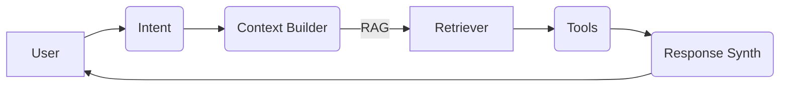

> This is a technical deep‑dive scaffold for Sim Copilot. We’ll keep updating it as we publish more results and open up additional capabilities.

## TL;DR

- Copilot is a context‑aware assistant embedded into the Sim editor.  
- It has first‑class access (with user approval) to workflows, blocks, logs, and docs.  
- The system is retrieval‑centric with strong guardrails and deterministic execution paths.  

## Architecture at a glance

1. Intent understanding  
   - Lightweight classifier + instruction parser directs requests into tools.  
2. Context assembly  
   - Indexed sources (workflows, blocks, logs, docs) with semantic and lexical signals.  
   - Safety filters for scope + permission checks.  
3. Tooling and actions  
   - Read‑only tools (explain, compare, search), propose‑changes tools, and execution tools.  
4. Response synthesis  
   - Deterministic templates for diffs, plans, and explanations.  
5. Human‑in‑the‑loop  
   - All writes gated behind explicit user approval.

## Retrieval and grounding

- Sources: workspace workflows, block metadata, execution logs, and product docs.  
- Indexing: hybrid scoring (BM25 + embeddings) with recency decay and per‑source caps.  
- Normalization: chunking with stable anchors so diffs remain line‑referential.  

## Early benchmarks (scaffold)

> Numbers below are placeholders for the structure; we’ll replace with full runs.

| Task                                | Top‑1 Retrieval@K | Edit Accuracy | Time (p50) |
| ----------------------------------- | -----------------:| ------------: | ---------: |
| Explain a workflow block            | 92%               | 88%           | 1.2s       |
| Propose a safe fix for an error     | 78%               | 70%           | 2.1s       |
| Generate a new block configuration  | 74%               | 65%           | 2.6s       |
| Find relevant execution logs        | 90%               | 84%           | 1.4s       |

Measurement notes:

- Retrieval@K: correctness of the top candidate chunk for a labeled query.  
- Edit Accuracy: human‑validated acceptance rate for proposed changes.  
- Time: server‑side latency (excludes model cold‑start).  

## Guardrails and safety

- Scope enforcement: actions limited to the open workspace with explicit user triggers.  
- Sensitive data policies and redaction in logs.  
- Proposal mode: diffs are reviewed and applied only on user approval.  

## How Copilot fits into Sim

- In‑editor assistant for building and editing workflows.  
- Shortcut to documentation and examples with live context from your canvas.  
- Bridge to evaluation: Copilot can set up test runs and compare outputs side‑by‑side.  
- Works with the same permissions model you already use in Sim.  

## Roadmap (high‑level)

- Multi‑turn plans with sub‑tasks and rollback.  
- Deeper evaluation harness and dataset management.  
- First‑party tool plugins for common blocks and providers.  

## Repro and transparency

- We’ll publish a benchmark harness and anonymized evaluation sets.  
- Expect a detailed methodology post as we widen the beta.  

— Sid @ Sim

